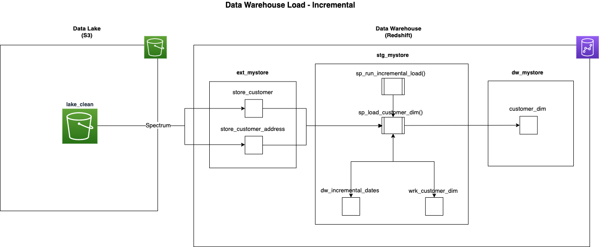
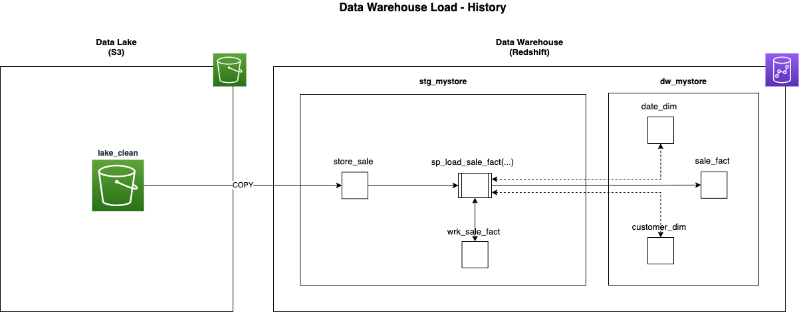

## Data Pipeline

The data warehouse implements an ELT strategy to ingest data from the data lake. 
The ELT strategy consists of loading prepared data from the Clean layer of the data lake into the data warehouse and then transforming it into a specific data model optimized for the business queries.

The following steps outline the data pipeline from the data lake into the data warehouse:

1. AWS Glue Workflow reads CSV files from the Raw layer of the data lake and writes them to the Clean layer as Parquet files.
2. Stored procedures in Amazon Redshift’s `stg_mystore` schema extract data from the Clean layer of the data lake using 
[Amazon Redshift Spectrum](https://docs.aws.amazon.com/redshift/latest/dg/c-using-spectrum.html) via the `ext_mystore` external schema imported from the [AWS Glue Data Catalog](https://docs.aws.amazon.com/redshift/latest/dg/c-spectrum-external-schemas.html) 
for incremental loads, or the [COPY command](https://docs.aws.amazon.com/redshift/latest/dg/t_Loading_tables_with_the_COPY_command.html) for history loads.
3. The stored procedures then transform and load the data into a star schema model in the `dw_mystore` schema.

## Incremental Loads

This diagram describes the process flow for the incremental load of the `customer_dim` dimension table.

1. The incremental load process is initiated by calling the stored procedure `sp_run_incremental_load`. In production, `sp_run_incremental_load` is called every 30 mins by the 
[Amazon Redshift Data API](https://docs.aws.amazon.com/redshift/latest/mgmt/data-api.html) via an 
[AWS Step Function](https://docs.aws.amazon.com/step-functions/latest/dg/welcome.html). No parameters are required for this 
procedure. The procedure loads each target star schema table in series, dimensions first then facts. The following steps 
explain the loading of the `customer_dim` dimension.
2. `sp_run_incremental_load` calls the `sp_load_customer_dim` stored procedure.
3. `sp_load_customer_dim` selects a high watermark timestamp from the `dw_incremental_dates` table for each of the 
customer_dim’s source tables. A high watermark is a timestamp that records the maximum date and time of the data from 
the previous load. This is used as a start date for the next load, ensuring only new or changed data is processed.
4. `sp_load_customer_dim` selects data from tables in the `ext_mystore` external schema, external tables return 
data from the data lake via Amazon Redshift Spectrum. This procedure then transforms and loads the data into the `wrk_customer_dim` 
working table. A working table is a normal table used to temporarily hold data to be processed and is cleared out at 
the beginning of every load. An Amazon Redshift [TEMPORARY](https://docs.aws.amazon.com/redshift/latest/dg/r_CREATE_TABLE_NEW.html) 
table could be used for this purpose; however, to facilitate debugging, a standard table has been used with the BACKUP NO 
setting to prevent the data from being copied to snapshots.
5. `sp_load_customer_dim` performs slowly changing dimension (SCD) type 1 and 2 logic loading into the target dimension 
`customer_dim`. The type of load into the target will be different depending on what kind of dimensional object is being 
loaded. SCD type 1 dimensions and fact tables are merged into by 
[replacing existing rows](https://docs.aws.amazon.com/redshift/latest/dg/t_updating-inserting-using-staging-tables-.html#merge-method-replace-existing-rows) 
in the target. Dimensions with SCD type 2 fields are loaded using multi-step logic. Surrogate keys are assigned to new 
dimension records by an [IDENTITY](https://docs.aws.amazon.com/redshift/latest/dg/r_CREATE_TABLE_NEW.html) column in the 
target table.

## History Loads

This diagram describes the process flow for the history load of the `sale_fact` table. History loads for other fact tables 
use a similar process.

1. The history load process for the sale_fact table is initiated by calling the stored procedure `sp_load_sale_fact`. This is a manual process run by an administrator via a SQL client tool when needed. The parameters `p_load_type VARCHAR`, `p_start_date DATE` and `p_end_date DATE` are required for this procedure. `p_load_type` needs to be set to `'HISTORY'`, `p_start_date` and `p_end_date` needs to be set to the date range to be loaded.
2. `sp_load_sale_fact` loops through the given date range and loads the `store_sale` staging table one day at a time with the [COPY command](https://docs.aws.amazon.com/redshift/latest/dg/t_Loading_tables_with_the_COPY_command.html). The procedure then selects data from the staging table, applies transformations, looks up surrogate keys from dimension tables in the `dw_mystore` schema, and loads the data into the `wrk_sale_fact` working table. The surrogate key lookups are performed by joining to dimension tables on the source system natural keys and returning the surrogate primary keys from the dimensions.
3. `sp_load_sale_fact` merges data from the working table into the target fact table. The merge is performed by joining 
the working table to the fact table, deleting rows out of the fact that exist in the working table, and then inserting 
all rows from the working table into the fact. This is all performed inside a transaction, so if any step fails, the 
whole change is rolled back. This merge process is explained in depth in the 
[Redshift Database Developer Guide](https://docs.aws.amazon.com/redshift/latest/dg/t_updating-inserting-using-staging-tables-.html#merge-method-replace-existing-rows).
